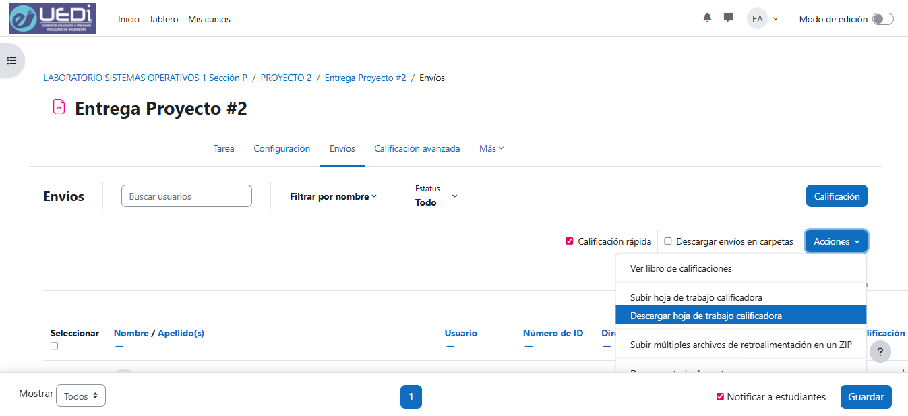

# auto_notas_uedi

## Automatización de calificaciones en UEDI

Script en Python para automatizar la carga de calificaciones en UEDI a partir de un archivo CSV de notas.

Todos sabemos que ingresar calificaciones manualmente en UEDI puede ser un proceso repetitivo y aburrido.  
Este script simplifica esa tarea, solo necesitas descargar la hoja de trabajo calificadora de la tarea a ingresar notas, preparar el archivo `notas.csv` con el formato requerido y ejecutar el programa para completar automáticamente las calificaciones correspondientes.




## Características principales
Uso de 2 archivos CSV:
- `notas.csv`: contiene los números de carnet y sus respectivas calificaciones.
- `hoja_uedi.csv`: la hoja de trabajo calificadora descargada de UEDI y renombrada para el uso del programa.

Estos archivos deben estar en la carpeta `datos/` o puedes especificar rutas personalizadas al ejecutar el programa con el argumento `-menu` para un menú interactivo o con `-n/--notas` y `-h/--hoja` para rutas directas.

## Formato de `notas.csv`

```csv
carnet,nota
199622440,100.00
201602659,85.00
```
- `carnet`: número de carnet del estudiante (sin guiones ni espacios)
- `nota`: calificación numérica (puede incluir decimales)

## Formato de `hoja_uedi.csv`

Columnas requeridas:

- `Numero de ID`: identificador del estudiante
- `Calificacion`: columna a actualizar

No es necesario modificar nada de la hoja de trabajo calificadora ya el programa se encargará de buscar el número de carnet en la columna `Numero de ID` y actualizar la columna `Calificacion` con la nota correspondiente del archivo `notas.csv`.

## Estructura del proyecto

```text
auto_notas_uedi/
├── main.py                      # Punto de entrada
├── src/
│   ├── core/                    # Lógica de negocio
│   ├── io/                      # Lectura y escritura de archivos
│   └── utils/                   # Utilidades de salida con Rich
├── datos/
│   ├── notas.csv                # columnas: carnet, nota
│   └── hoja_uedi.csv            # columnas: Numero de ID, Calificacion
└── hoja_uedi_llenada_con_notas.csv  # Archivo de salida
```

## Requisitos

- Python 3.11 o superior
- UV como gestor de paquetes

## Instalación

```bash
# Crear entorno virtual
uv venv

# Instalar dependencias
uv sync
```

## Uso

```bash
# Ejecutar con archivos por defecto (carpeta datos/)
uv run main.py

# Menú interactivo
uv run main.py -menu

# Usar rutas personalizadas
uv run main.py -n ruta/notas.csv -h ruta/hoja_uedi.csv
```

## Ejecutar tests

```bash
uv sync --extra dev
uv run pytest
```

## Casos de Errores

- Si un número de carnet en `notas.csv` no se encuentra en `hoja_uedi.csv`, se mostrará un mensaje de advertencia pero el programa continuará ejecutándose.
- El programa maneja automáticamente variantes de IDs (con ceros al inicio, 8 o 9 dígitos). Si un ID no coincide, se asignará 0 y deberá corregirse manualmente en el archivo de salida.
- En dado caso surga un error con carnets duplicados o mal formateados, el programa indicará el problema específico y te dira el nombre del estudiante para que lo busques en el archivo de salida `hoja_uedi_llenada_con_notas.csv` y lo corrijas manualmente.
- Si el formato de los archivos CSV no es correcto (por ejemplo, columnas faltantes), el programa mostrará un mensaje de error y se detendrá.
- El archivo de salida se genera con codificación UTF-8 con BOM para compatibilidad con Moodle/Excel.


## Autoría

Desarrollado por **@roldyoran**